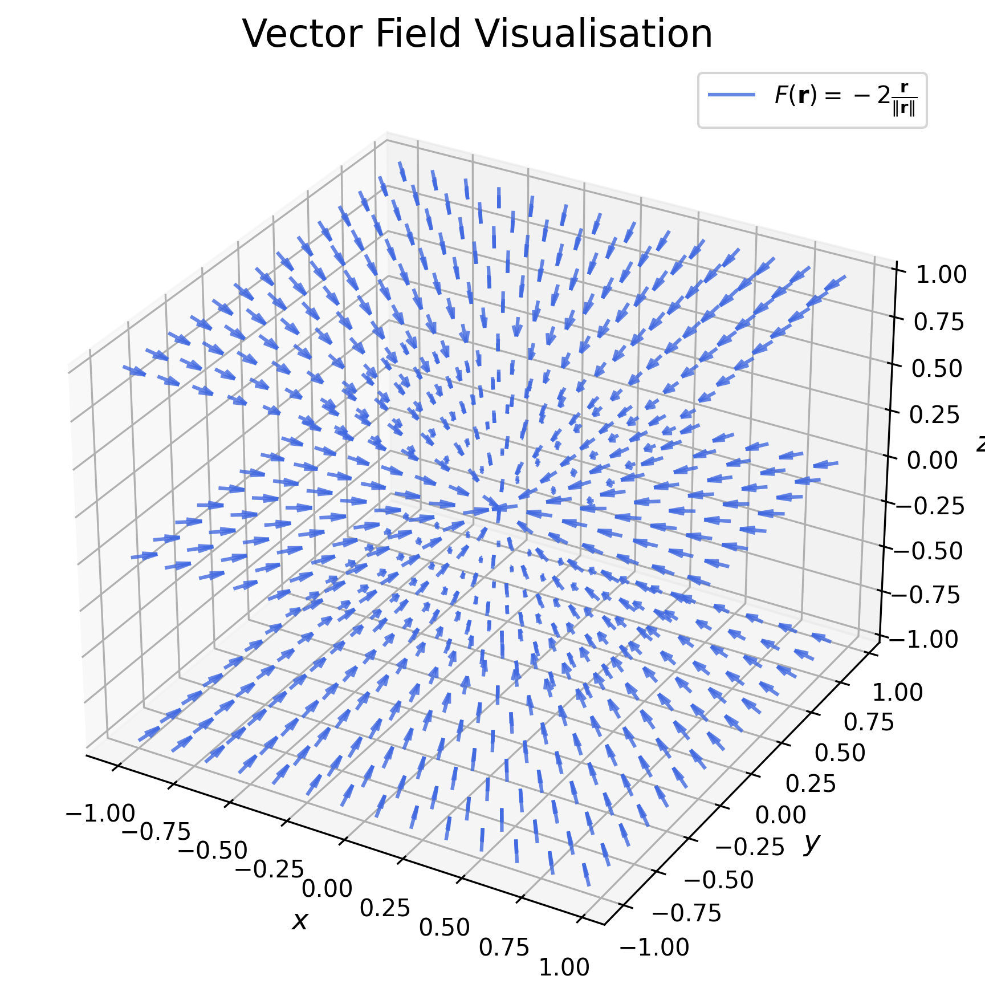
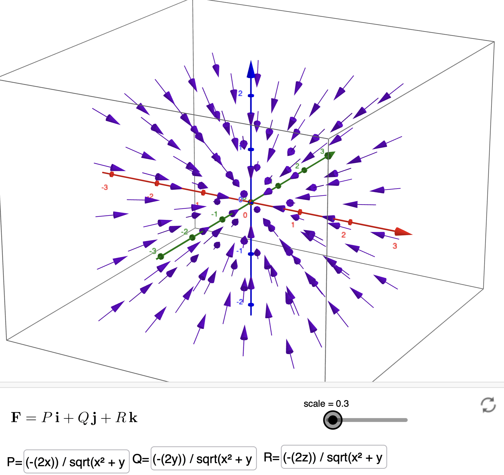
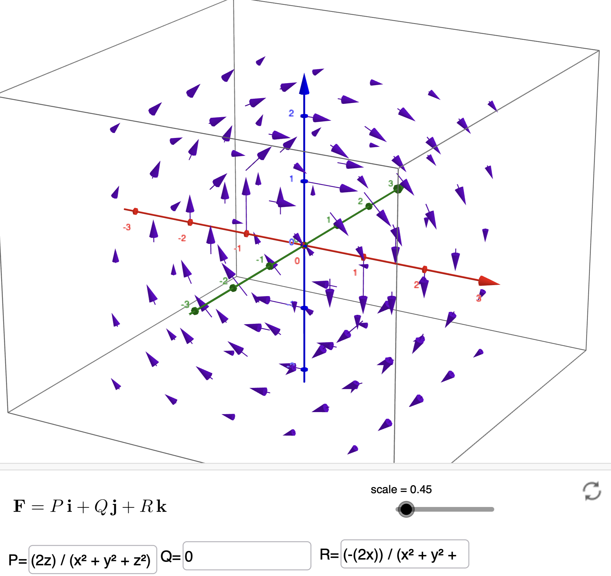
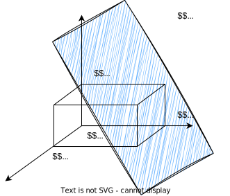

# Vector Calculus Assignment 1 Solutions

## General Instructions
The following document contains the solutions to the questions for Assignment 1. Please note that the solutions provided may not be the only possible way to solve the questions. They indicate only one of the many (possibly) valid solutions. The solutions provided are relatively crisp and do not include all the steps that you must have. Your solution should be logical and contain all supporting arguments. Feel free to contact any of the TAs via email in case of any discrepancy you find in the solutions provided.

## Question 1

$a)$ We can write the position vector $\mathbf{r}$ as $x \hat i + y \hat j + z \hat k$. The function $F(\mathbf{r})$ can be expressed in terms of $x, y, z$ as follows

$$
\begin{align*}
F(\mathbf{r}) &= -2{\mathbf{r}\over \lVert \mathbf{r} \rVert}\\
&= -2\left({\mathbf{r}\over \sqrt{x^2 + y^2 + z^2}}\right)\\
&= -{2x\over \sqrt{x^2 + y^2 + z^2}}\hat i - {2y\over \sqrt{x^2 + y^2 + z^2}}\hat j - {2z\over\sqrt{x^2 + y^2 + z^2}}\hat k\\
\end{align*}
$$

Plotting the vector field $F(\mathbf{r})$:

<p align="center">
 
</p>

$b)$ Similarly, we express the function $F(\mathbf{r})$ in terms of $x, y, z$ to plot the vector field.

$$
\begin{align*}
F(\mathbf{r}) &= 2{\mathbf{e_2}\times \mathbf{r}\over \lVert \mathbf{r} \rVert^2}\\
\end{align*}
$$

First, compute the cross product:

$$
\begin{align*}
\mathbf{e_2}\times \mathbf{r} &= \begin{vmatrix}
\hat i & \hat j & \hat k\\
0 & 1 & 0\\
x & y & z\\
\end{vmatrix}\\
&= (z - 0)\hat i - (0 - 0)\hat j + (0 - x)\hat k\\
&= z\hat i - x\hat k\\
\end{align*}
$$

Thus, we have

$$
\begin{align*}
F(\mathbf{r}) &= 2\left({\mathbf{e_2}\times \mathbf{r}\over \lVert \mathbf{r} \rVert^2}\right)\\
&= 2\left({z\hat i - x\hat k\over x^2 + y^2 + z^2}\right)\\
&= {2z\over x^2 + y^2 + z^2}\hat i + 0\hat j -{2x\over x^2 + y^2 + z^2}\hat k\\
\end{align*}
$$

Plotting the vector field $F(\mathbf{r})$:

<p align="center">
 
</p>

The code for the above plots can be found in the jupyter notebook [```question1.ipynb```](./question1.ipynb). To play around with other vector field functions and for better visualisation, please use [GeoGebra](https://www.geogebra.org/m/u3xregNW).

## Question 2

$a)$ Equation of a plane from three points on it
The idea is relatively straightforward here. We generally define a plane as follows:

$$
\begin{align*}
\left\langle \mathbf{n}\ , \ \mathbf{r}-\mathbf{r_0}\right\rangle=0
\end{align*}
$$

Thus, we need to first find a vector normal to the plane. Since we have three points on the plane, we will find $2$ vectors on it, and take their cross product and normalize it to find the unit vector normal to the plane. 

Let the points be represented by the vectors $\mathbf{a}, \mathbf{b}, \mathbf{c}$, where:  

$$
\begin{align*}
\mathbf{a}=(\mathbf{e_1},\mathbf{e_2},\mathbf{e_3}) \\ 
\mathbf{b}=(3\mathbf{e_1},2\mathbf{e_2},\mathbf{e_3})\\ 
\mathbf{c}=(4\mathbf{e_1},\mathbf{e_2},2\mathbf{e_3})\\
\end{align*}
$$

Let the two new vectors be: 

$$
\begin{align*}
\mathbf{a_1}=\mathbf{b-a}=2\mathbf{e_1}+\mathbf{e_2} \\
\mathbf{a_2}=\mathbf{c-a}=3\mathbf{e_1}+\mathbf{e_3}\\
\end{align*}
$$ 

Thus, 

$$
\begin{align*}
\mathbf{n}=\frac{\mathbf{a_1}\times \mathbf{a_2}}{\lVert\mathbf{a_1}\times \mathbf{a_2}\rVert}=\frac{1}{\sqrt{14}}\mathbf{e_1}-\frac{2}{\sqrt{14}}\mathbf{e_2}-\frac{3}{\sqrt{14}}\mathbf{e_3}
\end{align*}
$$

Thus, the equation of the plane is 

$$
\begin{align*}
\left\langle\frac{1}{\sqrt{14}}\mathbf{e_1}-\frac{2}{\sqrt{14}}\mathbf{e_2}-\frac{3}{\sqrt{14}}\mathbf{e_3}\ ,\ \mathbf{r}-\mathbf{(\mathbf{e_1}+\mathbf{e_2}+\mathbf{e_3})}\right\rangle=0
\end{align*}
$$

$b)$ Unit vector normal to the plane
This has been computed above:

$$
\mathbf{n}=\frac{1}{\sqrt{14}}\mathbf{e_1}-\frac{2}{\sqrt{14}}\mathbf{e_2}-\frac{3}{\sqrt{14}}\mathbf{e_3}
$$

$c)$ Dot product calculation

$$
\begin{align*}
\left\langle 2\mathbf{e_1}+3\mathbf{e_2}-\mathbf{e_3}\ , \ \frac{1}{\sqrt{14}}\mathbf{e_1}-\frac{2}{\sqrt{14}}\mathbf{e_2}-\frac{3}{\sqrt{14}}\mathbf{e_3}\right\rangle=\frac{-1}{\sqrt{14}}
\end{align*}
$$

## Question 3
$a)$ The general equation of a line $\it{L}$ parallel to vector $\mathbf{r}$ and passing through q point represented by the vector $\mathbf{p_0}$ is given by

$$
\mathbf{p_0} + \lambda \mathbf{r} \quad \lambda \in \mathbb{R}
$$

Here, $\mathbf{r}$ can be computed as follows:

$$
\begin{align*}
\mathbf{r} &= \mathbf{p_1 - p_0} \\
&= 2\mathbf{e}_1 + 3\mathbf{e}_2 + 4\mathbf{e}_3 \\
\implies \it{L} &= \mathbf{e}_1 + \mathbf{e}_2 + \mathbf{e}_3 + \lambda(2\mathbf{e}_1 + 3\mathbf{e}_2 + 4\mathbf{e}_3) \\
&= (1 + 2\lambda)\mathbf{e}_1 + (1 + 3\lambda)\mathbf{e}_2 + (1 + 4\lambda)\mathbf{e}_3
\end{align*}
$$

$b)$ The point is found using the condition that it lies at the intersection of the line passing through $(2, 2, 2)$ perpendicular to $\it{L}$, and $\it{L}$. Let the point be $(x, y, z)$

$$
\begin{align*}
&\implies (1 + 2\lambda-2)(2) + (1 + 3\lambda-2)(3) + (1 + 4\lambda-2)(4) = 0 \\
&\implies \lambda = {9 \over 29} \\
&\implies x = {47 \over 29}, y = {56 \over 29}, z = {65 \over 29}
\end{align*}
$$

## Question 4

Given $\mathbf{u}\in \mathbb{R}^3$ and $\mathbf{v}\in \mathbb{R}^3$ such that $\mathbf{e_u}\neq \mathbf{e_v}$

$a)$ Consider $\langle\mathbf{u}, \left({\mathbf{u}\times \mathbf{v}}\right)\rangle$. Let $\mathbf{z} = \mathbf{u}\times \mathbf{v} \implies \mathbf{z} \perp \mathbf{u}$ and $\mathbf{z} \perp \mathbf{v}$. 

$$ 
\begin{align*}
&\implies \left\langle\mathbf{u}\ ,\  \mathbf{z}\right\rangle = \left\langle \mathbf{v}\ ,\ \mathbf{z}\right\rangle = 0\\
&\implies \left\langle\mathbf{u}\ , \ \left({\mathbf{u}\times \mathbf{v}}\right)\right\rangle = \left\langle\mathbf{u}\ ,\ \mathbf{z}\right\rangle = 0
\end{align*}
$$

$b)$ Consider $\left(\mathbf{u}\ \times \mathbf{3v}\right)\times \mathbf{v}$. We know that,

$$
\left(\mathbf{a}\ \times \mathbf{b}\right)\times \mathbf{c} = \left(\left\langle\mathbf{a}\ ,\ \mathbf{c}\right\rangle\right)\mathbf{b} - \left(\left\langle\mathbf{b}\ , \ \mathbf{c}\right\rangle\right)\mathbf{a}
$$

Using the above expression, we can write:

$$
\begin{align*}
\left(\mathbf{u}\ \times \mathbf{3v}\right)\times \mathbf{v} &= 3\left(\left(\mathbf{u}\ \times \mathbf{v}\right)\times \mathbf{v}\right) \\
&= 3\left\langle \mathbf{u}\ , \ \mathbf{v}\right\rangle \mathbf{v} - 3\left\langle \mathbf{v}\ , \ \mathbf{v}\right\rangle \mathbf{u} \\
&= 3\left(\lVert\mathbf{u}\rVert _ 2 \lVert\mathbf{v}\rVert _ 2 \cos\theta\right)\mathbf{v} - 3\left(\lVert\mathbf{v}\rVert ^2 _ 2\right)\mathbf{u} \\
\end{align*}
$$

where $\theta$ is the angle between $\mathbf{u}$ and $\mathbf{v}$, i.e., $\displaystyle{\cos\theta = \frac{\left\langle\mathbf{u}\ , \ \mathbf{v}\right\rangle}{\lVert \mathbf{u}\rVert _2 \lVert \mathbf{v}\rVert _2}}$

## Question 5
Adjacent sides of the parallelogram are $\mathbf{a}, \mathbf{b}$. Let $\theta$ be the acute angle between them. Then, its area is:

$$
\begin{align*}
\lVert \mathbf{a} \times \mathbf{b} \rVert _2 &= \lVert a\rVert _2 \lVert b\rVert _2\sin(\theta) \\
&= \lVert a\rVert _2\lVert b\rVert _2\sqrt{(1-\cos^2(\theta))} \\
&= \sqrt{\lVert a\rVert ^2 _2\lVert b\rVert ^2 _2(1-\cos ^2(\theta))} \\
&= \sqrt{\lVert a\rVert ^2 _2\lVert b\rVert ^2 _2-\lVert a\rVert ^2 _2\lVert b\rVert ^2 _2\cos^2(\theta)} \\
&=\sqrt{\lVert a\rVert ^2 _2\lVert b\rVert ^2 _2-\left(\left\langle\mathbf{a}, \mathbf{b}\right\rangle\right)^2} \\
\end{align*}
$$


This can also be proved by induction. However, that method requires the use of determinants, and has thus been avoided here.


## Question 6
$P_1$ is the plane formed by the $2$ three-dimensional planes perpendicular to $\mathbf{n_1}$ and $\mathbf{m_1}$ and $P_2$ is the plane formed by the $2$ three-dimensional planes perpendicular to $\mathbf{n_2}$ and $\mathbf{m_2}$.

$a)$ From the equations describing the planes it is clear that both $\it{P}_1$ and $\it{P}_2$ pass through $\mathbf{r}_0$. Thus, they intersect.

$b)$ The given $2$ planes cannot be parallel as they intersect at $\mathbf{r}_0$ but if the second plane was described by a different $\mathbf{r} _{0}'$ then the rank of the below matrix $\mathbf{A}$ must at least be $3$.

$$
\mathbf{Ar} = \begin{bmatrix}
\langle\mathbf{n_1} , \mathbf{r_0} \rangle\\
\langle\mathbf{m_1} , \mathbf{r_0}\rangle\\
\langle\mathbf{n_2}, \mathbf{r} _{0}{'}\rangle\\
\langle \mathbf {m_2} , \mathbf{r} _{0} {'}\rangle\\
\end{bmatrix}
$$

The above equation can be understood equivalently as applying a transformation $\mathbf{A}$ on any vector $\mathbf{r}$ in the four-dimensional space. The expressivity (span) of this transformation depends on the number of linearly independent vectors in $\mathbf{A}$, which in return can be described by the rank of the matrix.

But here, since $\mathbf{r_0 = r_{0}'}$, the planes are not parallel.


$c)$ The intersection of both planes can be found by solving 

$$
\left\langle\begin{bmatrix}
\mathbf{n_1} \\
\mathbf{m_1} \\
\mathbf{n_2} \\
\mathbf{m_2} \\
\end{bmatrix}, \mathbf{r - r_0}\right\rangle = 0
$$

For these planes to coincide, at most two of the four vectors $\mathbf{n_1, m_1, n_2, m_2}$ must be linearly independent.

$d)$ For these planes to intersect at only a single point, $\mathbf{r - r_0} = 0$ must be the only solution to the above equation i.e., $\mathbf{n_1, m_1, n_2, m_2}$ must all be mutually linearly independent.

$e)$ If exactly three of the four vectors are linearly independent, the planes intersect at a line.

$f)$ If the planes are described by $\mathbf{r} _ 0$ and $\mathbf{r}_{0}'$ and if exactly two vectors are linearly independent, the intersection of the $2$ planes is a three-dimensional plane.

## Question 7

Given: Three faces of a cuboid lie flat on the coordinate planes. This figure shows that one of the vertices is the origin: $(0,0,0)$. Let the length, breadth and height of the cuboid be $p$, $q$ and $r$. A rough sketch of the scenario has been shown below:

<p align="center">

</p>

Without loss of generality, we can consider that cuboid lies in the first octant. Thus, we can say that $p,q,r > 0$. 

By imposing the constraint that the cuboid lies in the first octant, we introduce conditions on the values of $a,b,c,d$ in the plane equation, because the vertex $(p,q,r)$ satisfies the plane equation.

Thus, $(0,0,0)$, $(p,0,0)$, $(0,q,0)$, $(0,0,r)$, $(p,q,0)$, $(p,0,r)$ and $(0,q,r)$ all lie on the same side of the plane. This can be visualised using the figure above.

Again, without loss of generality, we consider that the origin lies on the positive side of the plane i.e. $d > 0$. This means all the points lie on the positive side of the plane resulting in the following inequalities:

$$
\begin{align*}
d &\ge 0\\
ap + d &\ge 0\\
bq + d &\ge 0\\
cr + d &\ge 0\\
ap + bq + d &\ge 0\\
ap + cr + d &\ge 0\\
bq + cr + d &\ge 0\\
\end{align*}
$$

Another constraint is that the point $(p,q,r)$ should lie on the plane. Thus, the following equation should be hold:

$$
\begin{align*}
& ax + by + cz + d = 0\\
\implies &ap + bq + cr + d = 0\\
\implies &r = -\frac{ap + bq + d}{c}\\
\end{align*}
$$

Since $r>0$ and $ap+bq+d \ge 0$, we can write 

$$
\begin{align*}
-\frac{ap + bq + d}{c} &> 0\\
\implies {1\over c} &< 0\\
\implies c &< 0\\
\end{align*}
$$

Similarly, by performing manipulations on the other inequalities, we can write $a < 0$, $b < 0$, $c < 0$ and $d > 0$.

From our definition of length, breadth, and height, the volume of the cuboid is:

$$
\begin{align*}
&V = pqr\\
\implies & V = -pq\left(\frac{ap + bq + d}{c}\right) = -\frac{a}{c}p^2q - \frac{b}{c}pq^2 - \frac{d}{c}pq\\
\end{align*}
$$

The only variables in the above formula are $p$ and $q$. Hence, in order to maximise the volume, we need to maximise the above function with respect to $p$ and $q$. We can do this by setting the partial derivatives of the above function with respect to $p$ and $q$ to $0$.

$$
\implies \frac{\partial V}{\partial p} = \frac{\partial V}{\partial q} = 0\\
$$

Consider the partial derivative with respect to $p$:

$$
\begin{align*}
&\frac{\partial V}{\partial p} = 0\\
\implies& -\frac{2a}{c}pq - \frac{b}{c}q^2 - \frac{d}{c}q = 0\\
\implies& -q\left(\frac{2a}{c}p + \frac{b}{c}q + \frac{d}{c}\right) = 0\\
\implies& q = 0 ,\ \frac{2a}{c}p + \frac{b}{c}q + \frac{d}{c} = 0\\
\implies& q = 0,\ q = -\frac{2ap + d}{b}\\
\end{align*}
$$

Now, consider the partial derivative with respect to $q$:

$$
\begin{align*}
&\frac{\partial V}{\partial q} = 0\\
\implies& -\frac{a}{c}p^2 - \frac{2b}{c}pq - \frac{d}{c}p = 0\\
\end{align*}
$$

Substituting $q = 0$, we get:

$$
\begin{align*}
&-\frac{a}{c}p^2 - \frac{d}{c}p = 0\\
\implies& -p\left(\frac{a}{c}p + \frac{d}{c}\right) = 0\\
\implies& p = 0,\ p = -\frac{d}{a}\\
\end{align*}
$$

Substituting the other value of $q$ from the previous equation, we get:

$$
\begin{align*}
&-\frac{a}{c}p^2 - \frac{2b}{c}p\left(-\frac{2ap + d}{b}\right) - \frac{d}{c}p = 0\\
\implies& -\frac{a}{c}p^2 + \frac{4ap^2 + 2dp}{c} - \frac{d}{c}p = 0\\
\implies& -\frac{a}{c}p^2 + \frac{4ap^2}{c} + \frac{2dp}{c} - \frac{d}{c}p = 0\\
\implies &\frac{3ap^2}{c} + \frac{dp}{c} = 0\\
\implies& p\left(\frac{3ap}{c} + \frac{d}{c}\right) = 0\\
\implies& p = 0,\ p = -\frac{d}{3a}\\
&p = 0\implies q = -\frac{d}{b}\\
&p = -\frac{d}{3a}\implies q = -\frac{d}{3b}\\
\end{align*}
$$

Hence, the critical points are: $\displaystyle{\left(0,0\right), \left(-\frac{d}{a},0\right), \left(0,-\frac{d}{b}\right), \left(-\frac{d}{3a},-\frac{d}{3b}\right)}$

We saw that $\displaystyle{r = -\frac{ap + bq + d}{c}}$.

Hence, the value of $r$ obtained on substituting the pairs $\left(p,q\right)$ in the critical points are: $\displaystyle{-\frac{d}{c}, 0, 0, -\frac{d}{3c}}$.

Therefore, the critical points are $\displaystyle{\left(0,0,0\right), \left(-\frac{d}{a},0,-\frac{d}{c}\right), \left(0,-\frac{d}{b},-\frac{d}{c}\right), \left(-\frac{d}{3a},-\frac{d}{3b},-\frac{d}{3c}\right)}$.

For a non-zero volume, $p,q,r \neq 0$ . The only critical point that satisfies this condition is $\displaystyle{\left(-\frac{d}{3a},-\frac{d}{3b},-\frac{d}{3c}\right)}$.

Hence, the Maximum Volume =  $\displaystyle{pqr = -\frac{d}{3a}\times-\frac{d}{3b}\times-\frac{d}{3c} = -\frac{d^3}{27abc}}$

We have already proved that $a < 0$, $b < 0$, $c < 0$ and $d > 0$. Thus, the maximum volume is positive which is a good sanity check.

$\underline{\textbf{NOTE:}}$ Now, we will analyze and confirm the fact that the point we have found is indeed a maxima and the resultant volume obtained is positive. The Hessian of a function $f(p,q)$ is defined as follows:

$$
\begin{align*}
\begin{bmatrix}
\displaystyle\frac{\partial^2 f}{\partial p^2} & \displaystyle \frac{\partial^2 f}{\partial p \partial q} \\
\\
\displaystyle\frac{\partial^2 f}{\partial q \partial p} & \displaystyle\frac{\partial^2 f}{\partial q^2}
\end{bmatrix}
\end{align*}
$$

The function 

$$
\begin{align*}
f(p,q)&=V(p,q)= -\frac{a}{c}p^2q - \frac{b}{c}pq^2 - \frac{d}{c}pq\\
\end{align*}
$$

Thus, the Hessian is:

$$
\begin{align*}
H(p,q)&=
\begin{bmatrix}
\displaystyle-\frac{2aq}{c} & \displaystyle-\frac{2ap}{c}-\frac{2bq}{c}-\frac{d}{c} \\
\\
\displaystyle-\frac{2ap}{c}-\frac{2bq}{c}-\frac{d}{c} & \displaystyle-\frac{2pb}{c}
\end{bmatrix}
\end{align*}
$$

Substituting $p=-\frac{d}{3a}$ and $q=-\frac{d}{3b}$, we get:

$$
\begin{align*}
H\left(-\frac{d}{3a},-\frac{d}{3b}\right)&=
\begin{bmatrix}
\displaystyle\frac{2ad}{3bc} & \displaystyle\frac{d}{3c} \\
\\
\displaystyle\frac{d}{3c} & \displaystyle\frac{2bd}{3ac}
\end{bmatrix}
\end{align*}
$$

The determinant of the Hessian is denoted by $H$. This gives the product of the eigenvalues of the matrix and and the trace of the Hessian gives the sum of the eigenvalues. Let the eigenvalues be $\lambda_1, \lambda_2$. Thus, 

$$
\begin{align*}
\lambda_1 \lambda_2&=\frac{4d^2}{9c^2} \ge 0\\
\lambda_1 + \lambda_2&=\frac{2d}{3c}\left(\frac{a^2+b^2}{ab}\right) \ge 0
\end{align*}
$$

The inequalities are obtained by substituting the inequalities $a < 0$, $b < 0$, $c < 0$ and $d > 0$.

Thus, both $\lambda_1, \ \lambda_2$ are negative. As the eigenvalues are negative, we can conclude that the Hessian matrix is a negative definite matrix. Thus, the critical point $\displaystyle{\left(-\frac{d}{3a},-\frac{d}{3b},-\frac{d}{3c}\right)}$ is a maxima.
